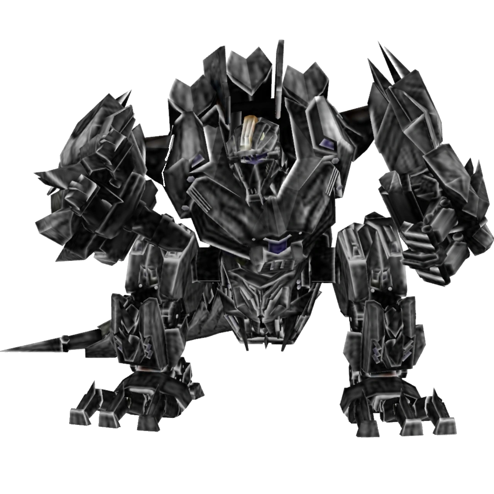

# trypticon

<p align="center">
  
</p>

> **A series of experiments implementing distributed training/serving techniques for LLMs from scratch.**

`trypticon` is an educational project that explores multi-GPU distributed training and experiment tracking with Weights & Biases.

---


### 1. Setup

```bash
git clone https://github.com/JINO-ROHIT/trypticon
cd trypticon

uv sync
```

### 2. Single-GPU Training

```bash
python -m trypticon.scripts.train
```

### 3. Multi-GPU Distributed Training

```bash
# Launch with torchrun (adjust nproc_per_node to your GPU count)
torchrun --nproc_per_node=2 -m trypticon.scripts.data_parallel
```